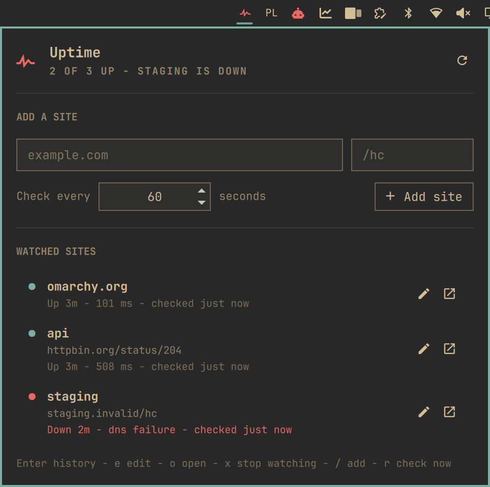
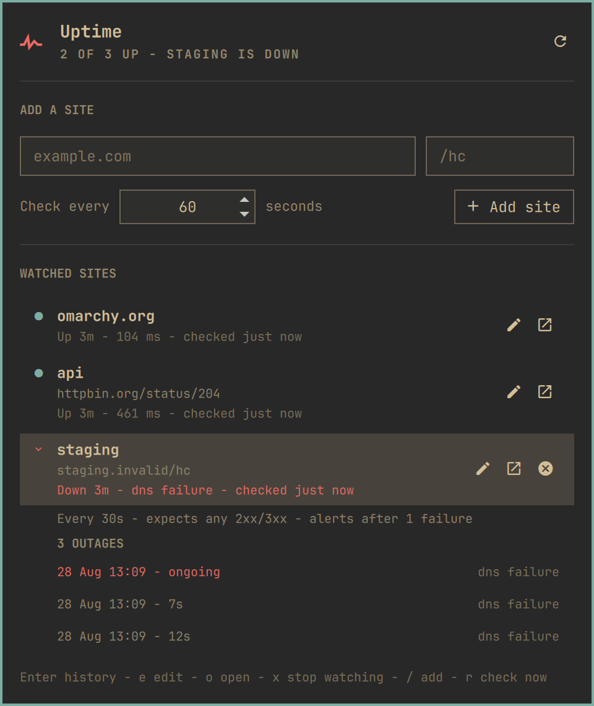
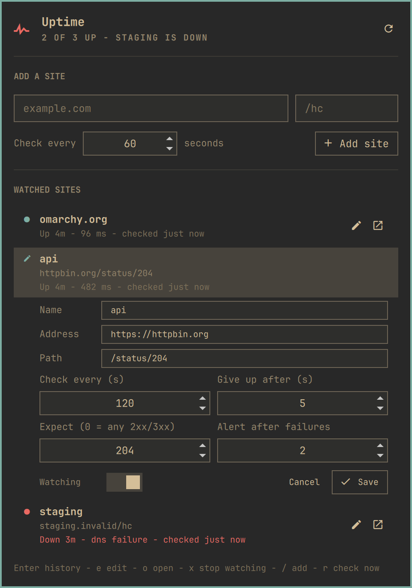
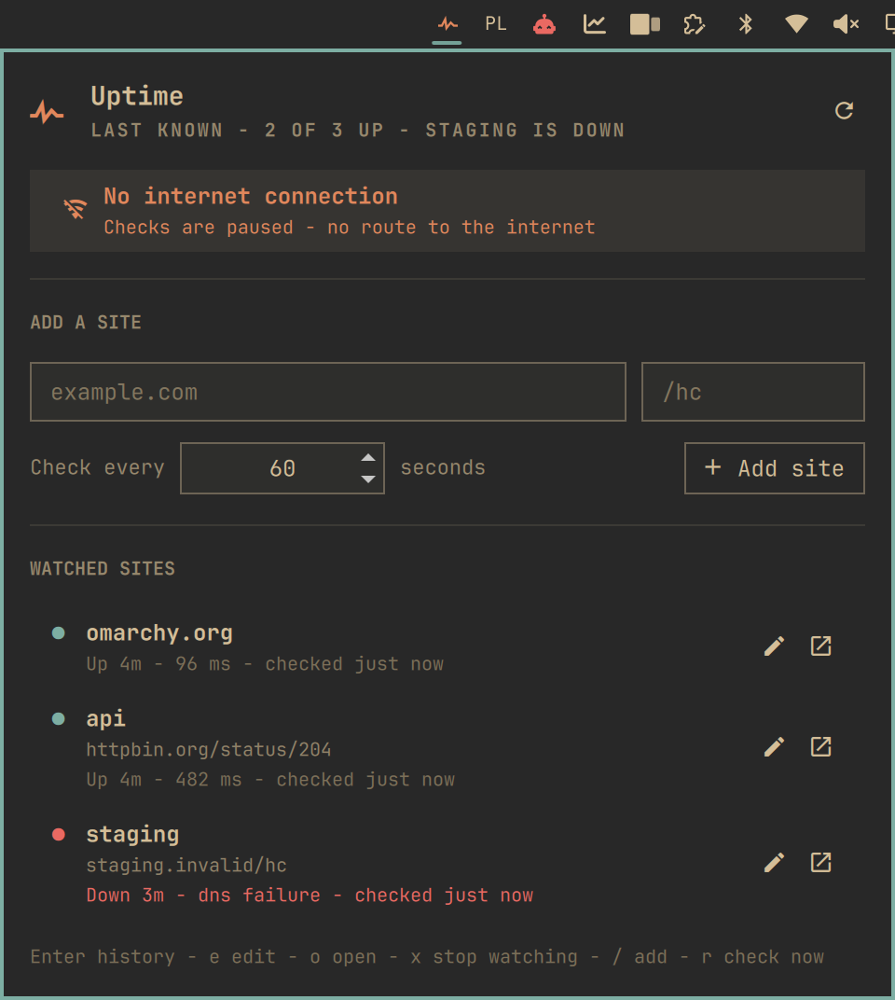

# Uptime

An [Omarchy](https://omarchy.org/) bar plugin that watches the sites you care
about and tells you the moment one stops answering.

Add a site, point it at a health check path if it has one, pick how often it
should be pinged, and forget about it. The bar icon stays quiet while
everything answers and turns red when it does not.



<sub>Screenshots use the Gruvbox theme — the plugin takes its colours from
whichever Omarchy theme you run, including the orange it warns with.</sub>

## What it gives you

- **A list you can actually keep.** Add a site from the top of the popup, edit
  every part of it later, pause one without losing its history, open any of
  them in your browser with one click.
- **Its own schedule per site.** A production box every 30 seconds, a staging
  box once an hour — they do not have to share an interval.
- **A health check path per site.** `https://example.com/hc`, or just the site
  itself.
- **Alerts that mean something.** A site counts as down only after a
  configurable number of consecutive failures, so one flaky check on café wifi
  never wakes you up.
- **Outage history, out of the way.** Every row knows when it stopped
  answering, how long it was out, and what the failure was — hidden until you
  ask for it.
- **Honest status lines.** `Up 2h - 84 ms - checked just now`. When a reading
  was taken is part of the reading.
- **It knows the difference between your connection and theirs.** Your own
  link to the internet is checked first. When it is down the bar icon turns
  orange, the popup says so in as many words, and nothing is recorded or
  alerted.
- **Keyboard everything.** The popup never needs the mouse.

Checks run in one background service rather than once per monitor, so a
three-screen desktop probes each site once and notifies once.

## Install

```bash
omarchy plugin add https://github.com/Majkelll/omarchy-uptime.git --enable
```

Click the pulse icon in the bar and add your first site. There is nothing to
configure by hand before that, and nothing is installed outside your home
directory.

## Watching a site

The popup opens with the add form on top, then everything you watch:

```
example.com                    /hc
Check every  [ 60 ] seconds          [ + Add site ]
```

Type a bare host and it becomes `https://`. Paste a full URL with a path and
the path lands in its own field. Every row then offers three things:

| | |
|---|---|
| **Click the row** | its outage history |
| **Pencil button** | edit everything about it |
| **Open button** | open it in your browser |

### Outage history

Hidden by default — a list of sites you are watching should read as a list of
sites, not a wall of incident reports. Click a row and it tells you how it is
checked and everything that has gone wrong, newest first, with an ongoing
outage marked as such.



### Edit mode

The pencil opens every field a site has: its name, its address, its health
check path, how often it is checked, how long a check may take before it
counts as a failure, which status code counts as healthy, how many failures in
a row count as an outage, and whether it is watched at all. Nothing is written
until you hit Save, and Escape cancels.



## Notifications

When a site crosses into down you get one critical notification; when it
answers again you get a quiet one saying how long it was out. Clicking either
opens the site.


## How a check works

Every site is fetched with `curl`, without following redirects, and judged by
what comes back:

| Result | Verdict |
|---|---|
| Status 200–399, no expected status set | up |
| Status matches the expected status | up |
| Any other status | down |
| Timeout, DNS failure, refused, TLS error | down |

Redirects are not followed on purpose: a `301` is a real answer from the
server, and following it would quietly check a different address than the one
you added.

A single failure never raises an alarm. A site is only *down* after
`failuresBeforeAlert` consecutive failures — two by default. The popup still
shows every individual check.

### Your connection is checked first

Close the lid at the office, open it on café wifi, and every site you watch
fails at the same moment — through no fault of theirs. So before any site is
touched, the plugin checks whether the machine can reach the internet at all,
the same way Omarchy's own network widget does it: a route to `1.1.1.1`, then
a one-second ping.

If that fails **and** nothing else answered in the same round, the whole round
is thrown away. Nothing is recorded and nobody is alerted. No timestamps move
either, so every site is due again the instant the connection comes back.

It says so plainly rather than quietly doing nothing: the bar icon turns
orange — not the red it uses for an outage, because nothing is known to be
down — and the popup leads with a banner. Every line underneath is labelled
`Last known`, because that is what it is.



The orange is the active theme's own, resolved the way Omarchy's
`omarchy-theme-color` resolves it, so it is the same hue every other Omarchy
surface would use for a warning.

A site that answered overrules the probe — plenty of networks serve HTTP while
dropping ICMP, and a probe that cannot run must never be the reason a real
outage goes unreported. If `1.1.1.1` is blackholed where you are, point the
probe somewhere else:

```bash
OMARCHY_UPTIME_PROBE=9.9.9.9
```

as an environment variable on the shell session that runs the plugin.

## Keyboard

| Key | Does |
|---|---|
| `↑` `↓` / `j` `k` | move between the add form and the sites |
| `Enter` | show a site's outage history |
| `e` | edit the selected site |
| `o` | open it in your browser |
| `x` | stop watching it |
| `/` | jump to the add form |
| `r` | check everything now |
| `Esc` | close the popup, or cancel an edit |

## Configuration

The site list lives in `~/.config/omarchy-uptime/sites.json`. The popup writes
it, and the plugin reloads it live when you edit it by hand — handy if you keep
it in your dotfiles.

```json
{
  "version": 1,
  "sites": [
    {
      "id": "myapp-hc",
      "name": "myapp",
      "origin": "https://myapp.example.com",
      "path": "/hc",
      "intervalSeconds": 60,
      "timeoutSeconds": 5,
      "expectedStatus": 0,
      "failuresBeforeAlert": 2,
      "enabled": true
    }
  ]
}
```

| Field | Meaning |
|---|---|
| `id` | Stable key the outage history is filed under. Derived from the address when omitted. |
| `name` | Display name. Falls back to the host. |
| `origin` | Scheme and host. A missing scheme becomes `https`. |
| `path` | Health check path, or `""` for the site itself. |
| `intervalSeconds` | Seconds between checks. 10 – 86400, default 60. |
| `timeoutSeconds` | Per-check timeout. 1 – 60, default 5. |
| `expectedStatus` | Exact status to require, or `0` for any 2xx/3xx. Default `0`. |
| `failuresBeforeAlert` | Consecutive failures before it counts as down. Default 2. |
| `enabled` | `false` pauses checks while keeping the site and its history. |

Anything out of range is clamped rather than rejected, and a row without a host
is skipped, so a hand-edited file cannot take the plugin down with it. A file
that is not valid JSON leaves the running configuration alone and says so in
the popup.

### Widget settings

| Setting | Default | Effect |
|---|---|---|
| Only show when something is down | off | Hides the bar icon while every site is up. |

## Commands

The service registers an IPC target, so scripts and keybindings can reach it:

```bash
omarchy-shell omarchy-uptime check    # check every site now
omarchy-shell omarchy-uptime status   # "2 of 3 up - myapp is down"
omarchy-shell omarchy-uptime list     # the site list as JSON
omarchy-shell omarchy-uptime toggle   # open or close the popup
```

`toggle` is what a keybinding wants. In `~/.config/hypr/bindings.conf`:

```
bindd = SUPER SHIFT, U, Uptime, exec, omarchy-shell omarchy-uptime toggle
```

Right-clicking the bar icon also forces an immediate check of every site. On a
multi-monitor desktop the popup opens on the first bar surface that registered
itself, since a popup belongs on one screen rather than all of them.

## Where things live

| Path | What |
|---|---|
| `~/.config/omarchy-uptime/sites.json` | the sites you watch — yours to edit |
| `~/.local/state/omarchy-uptime/state.json` | current status and outage history, capped at 50 outages per site |

Removing a site discards its history.

## Requirements

- [Omarchy](https://omarchy.org/) with `omarchy-shell` (the Quickshell bar).
- `curl` and `bash`, plus `omarchy-notification-send` and
  `omarchy-launch-browser` — all part of a base Omarchy install.

No package is installed, no daemon is started, and no `sudo` is required.

## Development

```bash
ln -s "$PWD" ~/.config/omarchy/plugins/io.github.majkelll.omarchy-uptime
omarchy-shell shell rescanPlugins
omarchy plugin enable io.github.majkelll.omarchy-uptime right
```

Saving a file under `~/.config/omarchy/plugins/` reloads the plugin
automatically.

The parsing, scheduling, and outage state machine live in `Model.js`, free of
Qt, so they run under Node:

```bash
node tests/model.test.js
```

`.github/workflows/tests.yml` runs those on every push, plus the check script
against a local HTTP server so its verdicts — 200, 404, an expected status, a
refused connection — are exercised for real.

| File | What |
|---|---|
| `Service.qml` | the schedule, the checks, the history, the notifications |
| `BarWidget.qml` | the bar icon |
| `Panel.qml` | the popup |
| `Model.js` | every decision the plugin makes, as pure functions |
| `scripts/omarchy-uptime-check` | probes targets in parallel with `curl` |

## License

MIT. See [LICENSE](LICENSE).
